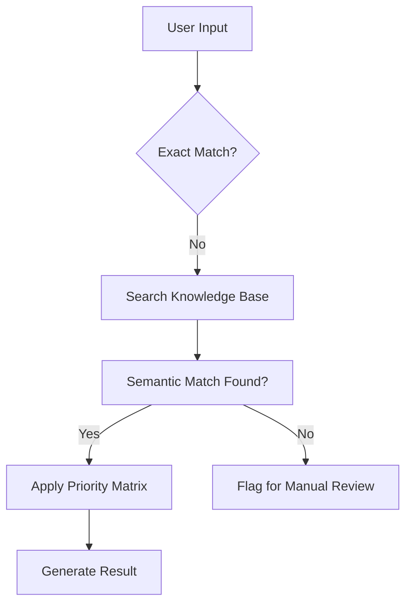

### **Document 06: RAG Knowledge Base Schema**

**File Name:** `06_RAG_Knowledge_Base_Schema.md`

This document defines the **Retrieval-Augmented Generation (RAG)** strategy used by the Agent. While your Power Automate flows handle structured CSV data, the Knowledge Base (KB) serves as the "Safety Net" for unstructured or ambiguous user queries.

---

## **1. Purpose**

The Knowledge Base allows the Agent to perform semantic searches when a direct match is not found in the `mserp_licensingrolemappingentities` table. It ensures the Agent can understand synonyms (e.g., "I handle the money" → "Finance") without needing an exact keyword match.

---

## **2. Schema Structure**

The KB is organized into three primary layers to facilitate the "Waterfall Search" logic.

| Layer | Content Type | Objective |
| --- | --- | --- |
| **Operational Layer** | Role-to-Duty Descriptions | Maps natural language phrases to specific D365 Roles. |
| **Technical Layer** | SKU & Priority Metadata | Provides the RECID, Priority, and Group Name for each SKU. |
| **Governance Layer** | Licensing Rules | Documents the "Base vs. Attach" logic and group-based suppression rules. |

---

## **3. Semantic Search Strategy**

When the Agent queries the KB, it follows this retrieval priority:

1. **Direct Keyword Match:** Checks for exact RECID or SKU Name strings.
2. **Thematic Search:** Clusters keywords into Groups (e.g., "Warehouse," "Shipping," "Logistics"  **Supply Chain Management**).
3. **Cross-Group Resolution:** If a query spans multiple groups, the KB reinforces the **Priority Rule**, selecting the SKU with the highest numerical value (e.g., SCM Premium at 100).

---

## **4. Data Indexing (The "Safety Net")**

To support the logic established in Document 03, the KB must be indexed with the following specific data points:

* **Priority 100-60:** High-tier Base candidates (SCM Premium, Finance Premium, etc.).
* **Priority 50-40:** Mid-tier candidates (Project Ops, HR).
* **Priority < 40:** Low-tier licenses that should be suppressed if a higher priority exists in the same session.

---

## **5. Maintenance Protocol**

* **Update Trigger:** Any time a new RECID is added to the mapping table, the KB must be re-indexed.
* **Conflict Resolution:** If the KB suggests a mapping that contradicts the CSV priority, the **CSV Structured Logic** (Document 03) always overrides the KB's semantic suggestion.

---
END OF Document
