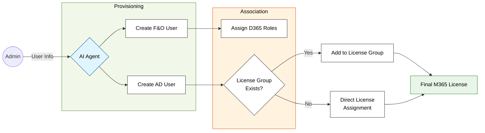
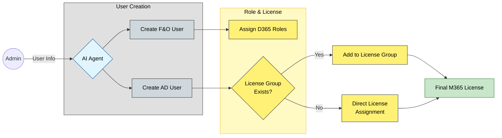
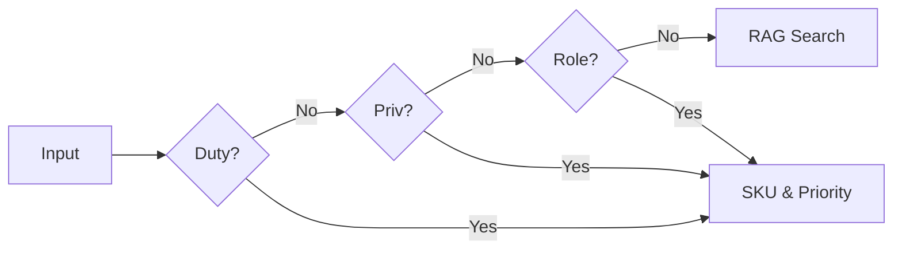

###Automated F&O User onboarding  Orchestrator

---
## 1. Project Overview

This repository contains the complete documentation, logic matrices, and technical specifications for an AI-driven **User Onboarding Orchestrator**. The system automates the end-to-end onboarding and offboarding of users in **Microsoft Entra ID (Active Directory)** and **Dynamics 365 Finance & Operations (F&O)** using natural language processing ,MCP and Power Automate.

By bridging the gap between human HR requests and technical system requirements, the orchestrator ensures that new hires are productive from minute one with the correct identity, permissions, and licenses.

### **Key Capabilities**

* **End-to-End User Provisioning:**
* **Microsoft Entra ID (AD):** Automatically creates the user account object, establishes the UPN, and configures critical identity metadata like `usageLocation`.
* **Dynamics 365 F&O:** Simultaneously creates the user record within the ERP environment, ensuring the identity is synchronized across the enterprise stack.

* **Semantic Role & Duty Mapping:**
* Translates natural language job descriptions (e.g., *"Handles vendor payments and bank reconciliations"*) into technical **D365 Roles, Duties, and Privileges**.
* Ensures that security permissions are granted based on the principle of least privilege while matching actual business functions.

* **Automated Security Role Assignment:**
* Directly pushes the identified security roles into the D365 user profile.

* **Intelligent License Optimization:**
* Automatically applies the "Base vs. Attach" priority rule (e.g., prioritizing SCM Premium over Finance) to minimize M365 licensing costs.
* Identifies when a "Team Member" license is sufficient vs. a full "Enterprise" license based on mapped duties.

* **Real-Time API Orchestration:**
* Communicates directly with **Microsoft Graph API** and **D365 OData entities** for instantaneous provisioning, removing the need for manual IT tickets and data entry.

---

## 2. The 10-Step Execution Framework

To bridge the gap between documentation and technical flows, the orchestrator follows this standardized 10-step lifecycle:

| Phase | Step | Name | Key Document |
| --- | --- | --- | --- |
| **Discovery** | 01-04 | **Identity & Intent** | [Doc 01](./docs/01_Functional_Specification.md) |
| **Intelligence** | **05** | **Role Mapping (Flow A)** | [Doc 02](./docs/02_Technical_Interface_Spec.md) |
|  | 08 | **License Optimization** | [Doc 03](./docs/03_Logic_Decision_Matrix.md) |
| **Execution** | **09** | **Provisioning (Flow B)** | [Doc 02](./docs/02_Technical_Interface_Spec.md) |
| **Closure** | 10 | **Verification** | [Doc 09](./docs/09_UAT_Test_Script.md) |

---

## 3. System Architecture

The following diagram illustrates the high-level interaction between the user, the AI Agent, and the enterprise backend systems.

---

## 4. Documentation Contents

* **[01_Functional_Specification.md](./docs/01_Functional_Specification.md):** High-level business goals and user workflows.
* **[02_Technical_Interface_Spec.md](./docs/02_Technical_Interface_Spec.md):** Detailed API payloads and sequence diagrams for Step 9.
* **[03_Logic_Decision_Matrix.md](./docs/03_Logic_Decision_Matrix.md):** The core "Priority Rule" for license suppression.
* **[04_SKU_Mapping_Reference.md](./docs/04_SKU_Mapping_Reference.md):** Valid strings for the Power Automate dictionary.
* **[05_Security_Compliance.md](./docs/05_Security_Compliance.md):** OAuth2 authentication and data privacy details.
* **[06_RAG_Knowledge_Base_Schema.md](./docs/06_RAG_Knowledge_Base_Schema.md):** Schema for semantic fallback search.
* **[07_Master_System_Prompt.txt](./docs/07_Master_System_Prompt.txt):** The core instruction set for the AI Agent.
* **[08_Technical_Specification.md](./docs/08_Technical_Specification.md):** "Under the hood" flow logic and waterfall search mechanics.
* **[09_UAT_Test_Script.md](./docs/09_UAT_Test_Script.md):** Step-by-step validation procedures.
* **[10_Project_Closeout.md](./docs/10_Project_Closeout.md):** Final deployment summary and maintenance guide.

---

## 5. Key Technical Logic

The system relies on a **Waterfall Search** to identify roles. If a direct duty name match is not found, the system cascades through privileges and role names to find the best fit.

---

## 6. Key Technical Logic (Step 6 Waterfall)

The system uses a **Waterfall Search** to identify roles. If a duty name match is not found, the system cascades through privileges and role names.

---

## 7. Key Technical Logic (Step 5 Waterfall)
The system uses a Waterfall Search to identify roles. If a duty name match is not found, the system cascades through privileges and role names.

Code snippet
graph TD
    Start[User Duty Input] --> D{Duty Match?}
    D -- No --> P{Privilege Match?}
    P -- No --> R{Role Match?}
    D -- Yes --> Result[Return SKU & Priority]
    P -- Yes --> Result
    R -- Yes --> Result
    R -- No --> Fallback[Trigger RAG Search]

8. Getting Started
🚀 View the Full Installation Guide

Configure Agent Brain: Copy the contents of 07_Master_System_Prompt.txt into Copilot Studio.

UAT Validation: Run the "New Hire Onboarding" scenario in 09_UAT_Test_Script.md to verify the Flow B (Step 9) connectivity.

## 5. Getting Started

## 🚀 Getting Started

To deploy the User Onboarding Orchestrator, please follow our detailed configuration guide. This ensures secrets are handled securely via Key Vault and environment endpoints are correctly mapped.

👉 **[View the Full Installation Guide](./docs/installation.md) 

⚙️ Final Configuration & Validation

Once the core infrastructure is deployed via the Installation Guide, complete these final steps to activate the AI Agent:

1. Configure the Agent Brain
The AI requires specific logic to handle duty mapping and licensing rules.

Open your AI Agent/Copilot Studio.

Navigate to Instructions/System Prompt.

Copy the full contents of 07_Master_System_Prompt.txt and paste them into the Agent's instructions.

2. User Acceptance Testing (UAT)
Before moving to production, verify that the AD, F&O, and Licensing flows are correctly linked.

Refer to Document 09: UAT Test Scripts.

Run the "New User  Onboarding" scenario to verify end-to-end connectivity across all systems.

---

