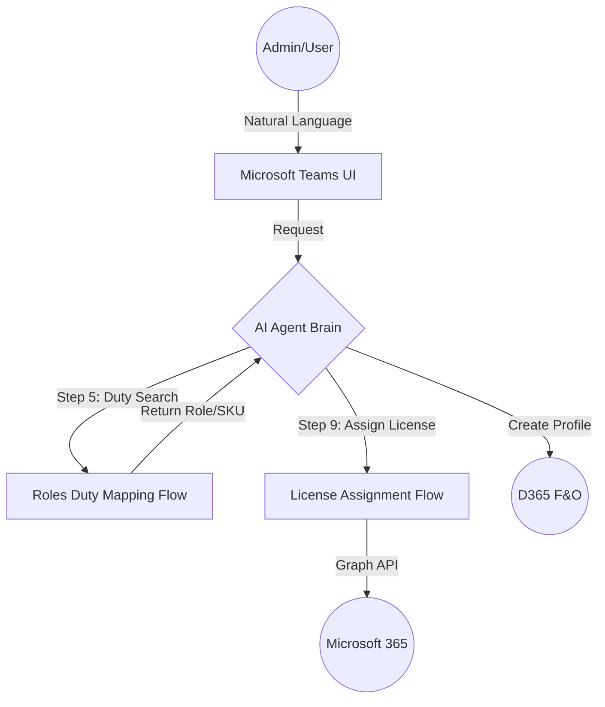
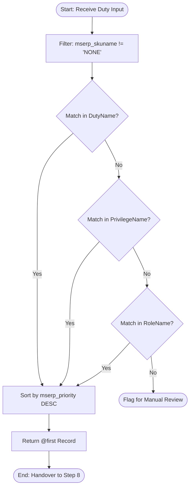

Automated F&O User onboarding  Orchestrator

---
## 1. Project Overview

This repository contains the complete documentation, logic matrices, and technical specifications for an AI-driven **User Lifecycle Orchestrator**. The system automates the end-to-end onboarding and offboarding of users in **Microsoft Entra ID (Active Directory)** and **Dynamics 365 Finance & Operations (F&O)** using natural language processing and Power Automate.

By bridging the gap between human HR requests and technical system requirements, the orchestrator ensures that new hires are productive from minute one with the correct identity, permissions, and licenses.

### **Key Capabilities**

* **End-to-End User Provisioning:**
* **Microsoft Entra ID (AD):** Automatically creates the user account object, establishes the UPN, and configures critical identity metadata like `usageLocation`.
* **Dynamics 365 F&O:** Simultaneously creates the user record within the ERP environment, ensuring the identity is synchronized across the enterprise stack.

* **Semantic Role & Duty Mapping:**
* Translates natural language job descriptions (e.g., *"Handles vendor payments and bank reconciliations"*) into technical **D365 Roles, Duties, and Privileges**.
* Ensures that security permissions are granted based on the principle of least privilege while matching actual business functions.

* **Automated Security Role Assignment:**
* Directly pushes the identified security roles into the D365 user profile.
* Dynamically manages membership in **Entra ID Security Groups**, ensuring that folder access and application permissions are aligned with the user’s ERP role.

* **Intelligent License Optimization:**
* Automatically applies the "Base vs. Attach" priority rule (e.g., prioritizing SCM Premium over Finance) to minimize M365 licensing costs.
* Identifies when a "Team Member" license is sufficient vs. a full "Enterprise" license based on mapped duties.

* **Real-Time API Orchestration:**
* Communicates directly with **Microsoft Graph API** and **D365 OData entities** for instantaneous provisioning, removing the need for manual IT tickets and data entry.

---

## 2. System Architecture

The following diagram illustrates the high-level interaction between the user, the AI Agent, and the enterprise backend systems.

---

## 3. Repository Contents

### Phase 1: Specifications

* **[01_Functional_Specification.md](https://www.google.com/search?q=./01_Functional_Specification.md):** High-level business goals and user workflows.
* **[02_Technical_Interface_Spec.md](https://www.google.com/search?q=./02_Technical_Interface_Spec.md):** Detailed API payloads and sequence diagrams for Step 9.
* **[08_Technical_Specification.md](https://www.google.com/search?q=./08_Technical_Specification.md):** "Under the hood" flow logic and waterfall search mechanics.

### Phase 2: Logic & Mapping

* **[03_Logic_Decision_Matrix.md](https://www.google.com/search?q=./03_Logic_Decision_Matrix.md):** The core "Priority Rule" for license suppression.
* **[04_SKU_Mapping_Reference.md](https://www.google.com/search?q=./04_SKU_Mapping_Reference.md):** Valid strings for the Power Automate dictionary.
* **[06_RAG_Knowledge_Base_Schema.md](https://www.google.com/search?q=./06_RAG_Knowledge_Base_Schema.md):** Schema for semantic fallback search.

### Phase 3: Deployment & Testing

* **[05_Security_Compliance.md](https://www.google.com/search?q=./05_Security_Compliance.md):** OAuth2 authentication and data privacy details.
* **[07_Master_System_Prompt.txt](https://www.google.com/search?q=./07_Master_System_Prompt.txt):** The core instruction set for the AI Agent.
* **[09_UAT_Test_Script.md](https://www.google.com/search?q=./09_UAT_Test_Script.md):** Step-by-step validation procedures.
* **[10_Project_Closeout.md](https://www.google.com/search?q=./10_Project_Closeout.md):** Final deployment summary and maintenance guide.

---

## 4. Key Technical Logic

The system relies on a **Waterfall Search** to identify roles. If a direct duty name match is not found, the system cascades through privileges and role names to find the best fit.

---

## 5. Getting Started

1. **Import Flows:** Upload the `.zip` packages for the Mapping and Licensing flows to your Power Automate environment.
2. **Configure Variables:** Update the ClientID and ClientSecret in the Step 9 flow.
3. **Configure Agent:** Copy the contents of `07_Master_System_Prompt.txt` into your AI Orchestrator's instructions.
4. **Run UAT:** Follow the scripts in Document 09 to verify connectivity.

---

