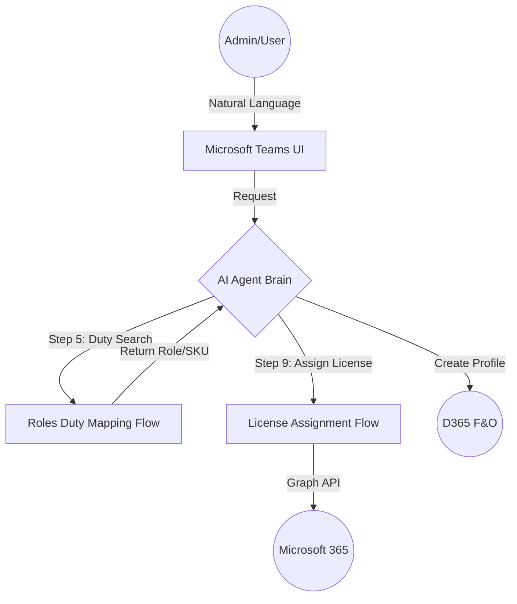
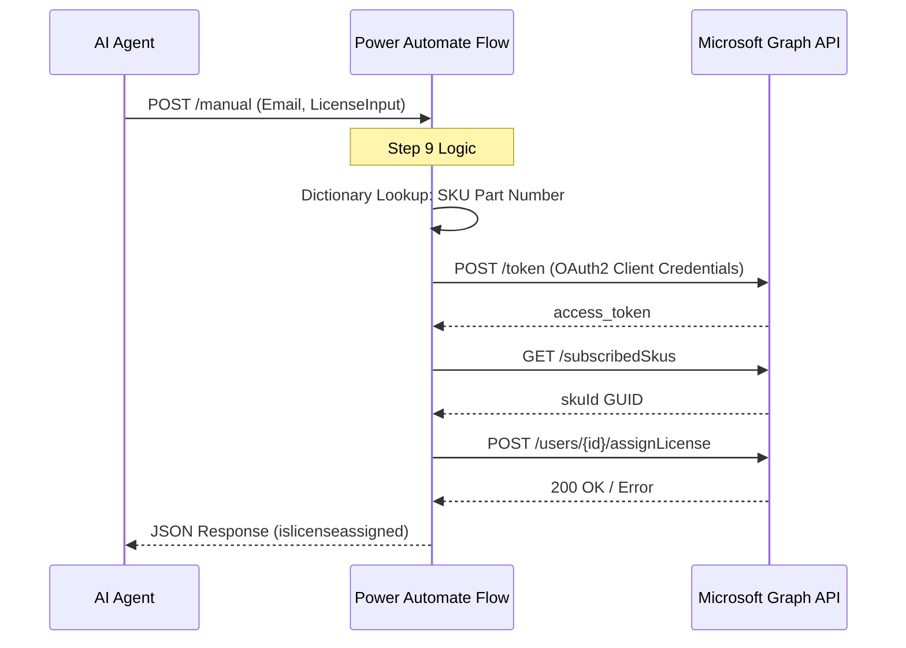
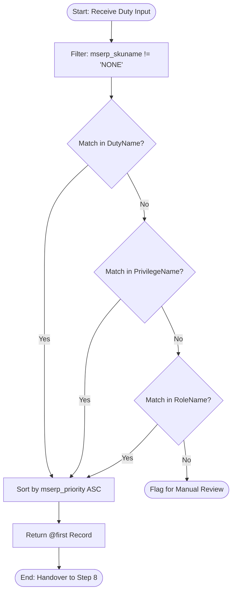

### **1. System Context Diagram (Document 01)**

This diagram illustrates the macro-level interaction between the user and the disparate cloud systems.



---

### **2. Technical Sequence Diagram (Document 02)**

This diagram maps the exact logic found in your `definition.json` for the license assignment process.



---

### **3. Waterfall Logic Flowchart (Document 03)**

This visualizes the search hierarchy and priority sorting logic used in your mapping flow.



---

### **Implementation Guide**

1. **Create a new file** in your repository (e.g., `DIAGRAMS.md`).
2. **Paste the code blocks** above into the file.
3. Ensure you wrap them in triple backticks with the `mermaid` identifier like this:
```markdown
```mermaid
[Code goes here]

```


```


```


**Your repository is now technically complete and visually documented.** Would you like me to help you draft a **README.md** that links all these 10 documents and 3 diagrams together into a professional landing page?
