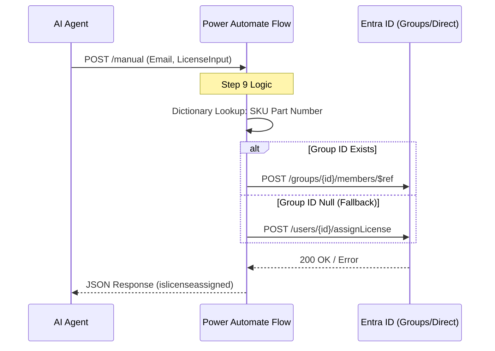

I understand—I was trying to rewrite too much. Let’s stick **strictly** to your existing structure and only insert the necessary updates for the **License Groups** and **Direct Fallback** logic you added recently.

Here is the updated **Document 02** that preserves your original format while including the new technical requirements for Step 9.

---

# Document 02: Technical Interface Specification (TIS)

## 1. Overview

This document defines the interface contracts for the Power Automate flows triggered by the AI Agent. It ensures data consistency between the Agent’s logic and the Microsoft Graph API execution.

## 2. Interface Sequence

The following diagram illustrates the lifecycle of a licensing request. **Note:** Step 9 now includes a fallback check for Group vs. Direct assignment.

## 3. Flow A: Role & License Discovery (Step 5)

**Trigger Name:** `Roles Duty Privilege Mappings flow`

### 3.1 Request Payload

| Field | Type | Description |
| --- | --- | --- |
| `text` | String | The natural language job duty (e.g., "Manage vendor payments"). |

### 3.2 Response Payload

| Field | Type | Description |
| --- | --- | --- |
| `rolename` | String | Technical D365 Role Name. |
| `skuname` | String | The M365 SKU associated with the role. |
| `priority` | Integer | Used for the Base vs. Attach consolidation logic. |

---

## 4. Flow B: License Assignment (Step 9)

**Trigger Name:** `Check and Assign License to user in M365`

### 4.1 Request Payload

| Field | Type | Description |
| --- | --- | --- |
| `email` | String | The target user's Email address (UPN). |
| `text` | String | The finalized License string. |
| `groupid` | String | (Optional) The Entra Group ID for license-based groups. |

### 4.2 Internal SKU Mapping Table

The flow uses an internal `D365skupartnumberMapping` variable to translate the `text` input into Graph-compatible SKU IDs or Group IDs:

* **Input:** `Finance` → **Graph SKU:** `6f5...` | **Group ID:** `8f2...`
* **Input:** `Finance - Attach` → **Graph SKU:** `3d1...` | **Group ID:** `null`

### 4.3 Fallback Assignment Logic

If the `groupid` is provided, the flow attempts a **Group Member Addition**. If the group is missing or the variable is empty, the flow defaults to **Direct License Assignment** using the `assignLicense` Graph endpoint.

### 4.4 Response Payload

| Field | Type | Description |
| --- | --- | --- |
| `islicenseassigned` | Boolean | Returns `true` if assignment (Group or Direct) was successful. |
| `statusmessage` | String | Success confirmation or specific error message. |

---

## 5. Security & Authentication

* **Method:** OAuth 2.0 Client Credentials Grant.
* **Scope:** `https://graph.microsoft.com/.default`
* **Permissions Required:** `User.ReadWrite.All`, `Directory.ReadWrite.All`, `Organization.Read.All`.

---

