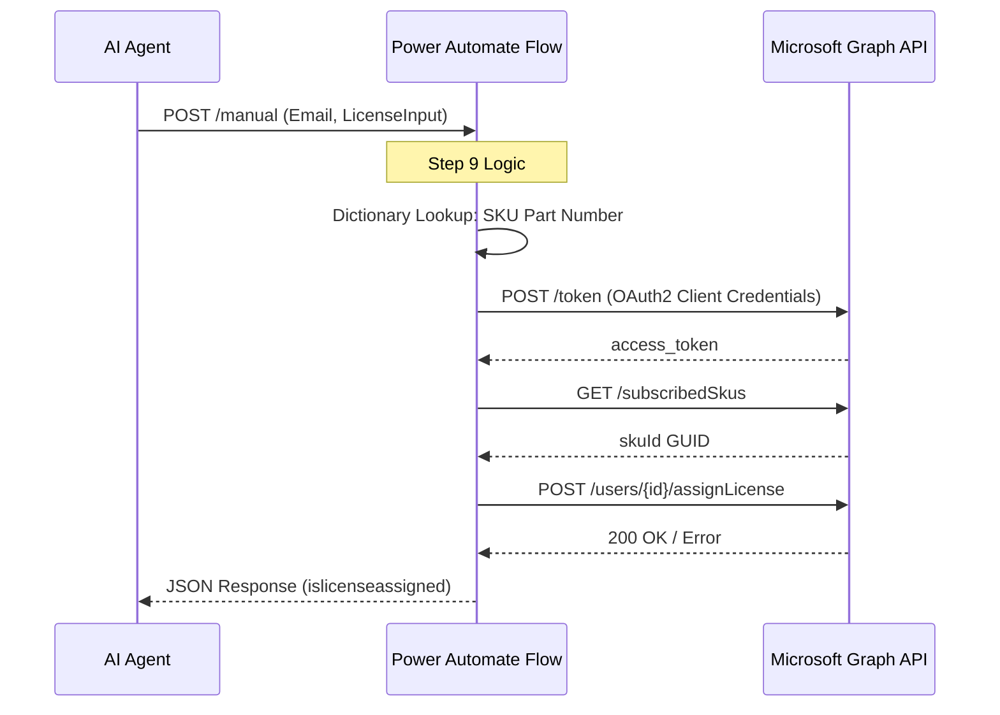

# Document 02: Technical Interface Specification (TIS)

## 1. Overview

This document defines the interface contracts for the Power Automate flows triggered by the AI Agent. It ensures data consistency between the Agent’s logic and the Microsoft Graph API execution.

## 2. Interface Sequence

The following diagram illustrates the lifecycle of a licensing request, from the Agent's initial trigger to the final response from Microsoft Graph.

## 3. Flow A: Role & License Discovery (Step 5)

**Trigger Name:** `Roles Duty Privilege Mappings flow`

### 3.1 Request Payload

| Field | Type | Description |
| --- | --- | --- |
| `text` | String | The natural language job duty (e.g., "Manage vendor payments"). |

### 3.2 Response Payload

| Field | Type | Description |
| --- | --- | --- |
| `rolename` | String | Technical D365 Role Name. |
| `skuname` | String | The M365 SKU associated with the role. |
| `priority` | Integer | Used for the Base vs. Attach consolidation logic. |

---

## 4. Flow B: License Assignment (Step 9)

**Trigger Name:** `Check and Assign License to user in M365`

### 4.1 Request Payload

| Field | Type | Description |
| --- | --- | --- |
| `email` | String | The target user's Email address (UPN). |
| `text` | String | The finalized License string (e.g., "Finance" or "Finance - Attach"). |

### 4.2 Internal SKU Mapping Table

The flow uses an internal `D365skupartnumberMapping` variable to translate the `text` input into Graph-compatible SKU IDs:

* **Input:** `Finance` → **Graph SKU:** `DYN365_FINANCE`
* **Input:** `Finance - Attach` → **Graph SKU:** `DYN365_FINANCE_ATTACH`
* **Input:** `Supply Chain Management` → **Graph SKU:** `DYN365_SCM`

### 4.3 Response Payload

| Field | Type | Description |
| --- | --- | --- |
| `islicenseassigned` | Boolean | Returns `true` if the Graph API call was successful. |
| `statusmessage` | String | Contains the success confirmation or the specific Graph error message. |

---

## 5. Security & Authentication

* **Method:** OAuth 2.0 Client Credentials Grant.
* **Scope:** `https://graph.microsoft.com/.default`
* **Permissions Required:** `User.ReadWrite.All`, `Directory.ReadWrite.All`, `Organization.Read.All`.

---

**Next Step for you:**
Once this is saved, would you like me to provide the content for **03_Logic_Decision_Matrix.md**, which explains exactly how the Agent decides which license is the "Base" and which is the "Attach" based on the priorities?
