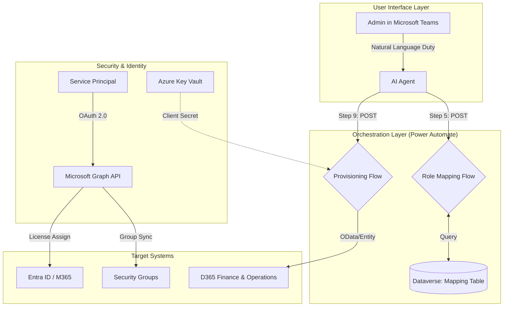

---

# Document 10: Project Closeout & Maintenance

## 1. Handover Summary

The **F&O User Onboarding Agent** is now production-ready. This solution automates the translation of natural language job duties into cost-optimized D365 and M365 license assignments using a verified priority hierarchy. By utilizing the "Base + Attach" logic, the system ensures compliance with Microsoft licensing guidelines while minimizing manual IT intervention.

## 2. Maintenance Tasks

To ensure the long-term health of the integration, the following recurring tasks are required:

* **Quarterly SKU Review:** Update **Document 04 (SKU Mapping)** if Microsoft changes technical `SkuPartNames` (e.g., if "Finance" is renamed in the licensing portal).
* **Secret Rotation:** The Client Secret in Entra ID (Azure AD) used by the Step 9 flow should be rotated every 12 months. Update the value in the **Azure Key Vault** or Power Automate environment variables accordingly.
* **Priority Audit:** Periodically review the `mserp_priority` values. If business needs change (e.g., a shift in which license should be the "Base"), update the CSV source data to reflect the new hierarchy.
* **Usage Location Defaults:** Monitor for new regional requirements. Currently, the flow defaults to "US" for users with a null `usageLocation`.

## 3. Final Architecture Map

This map illustrates the flow of data from the initial user request through the automation layer to the final Microsoft Cloud endpoints.

## 4. Final Verification Checklist

Prior to closing the project, ensure the following are confirmed:

1. [ ] **Document 07** (Master System Prompt) is loaded into the Agent.
2. [ ] All **Power Automate Flows** are turned "ON."
3. [ ] **Service Principal** has `User.ReadWrite.All` and `Directory.ReadWrite.All` permissions.
4. [ ] **Step 8 Logic** correctly identifies SCM Premium (100) as the Base over Finance Premium (90).

---

END OF DOCUMENT
